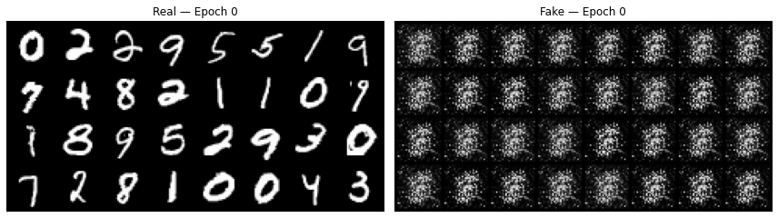
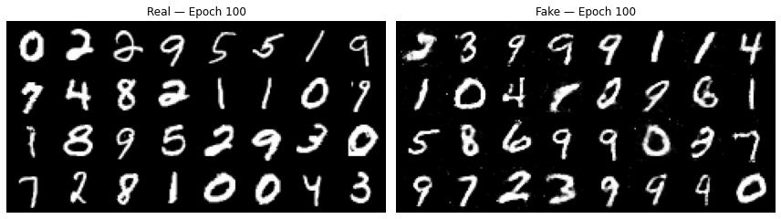
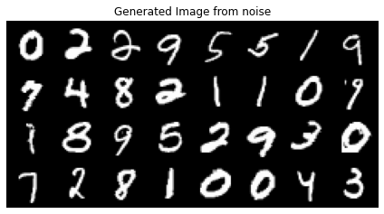
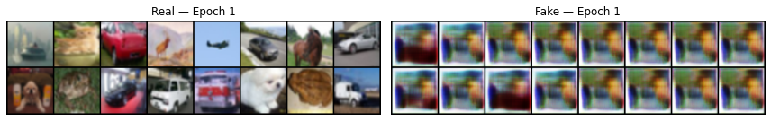
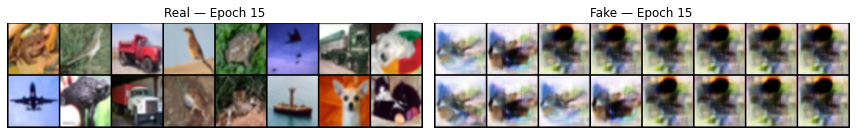

# GAN from Scratch

Two GANs built from scratch. 1. Unconditional GAN trained on MNIST - generates handwritten digits from random noise. 2. Text-conditioned DCGAN trained on CIFAR-10 - generates images based on text descriptions of each class using CLIP embeddings.

---

## Part 1 - Unconditional GAN (MNIST)

### What is it?
A simple GAN trained on the MNIST dataset. The generator takes random noise as input and learns to generate handwritten digit images. The discriminator learns to distinguish real MNIST images from generated fakes.

### Architecture
Generator:    noise (128) → Linear → BatchNorm → Linear → BatchNorm → Linear → Tanh → 28x28 image

Discriminator: 28x28 image → Linear → LeakyReLU → Linear → LeakyReLU → Linear → Sigmoid

### How it works
- Generator receives random noise vector and produces a fake image
- Discriminator sees both real and fake images and calculates loss for each
- Average of real and fake loss = discriminator loss
- Generator uses discriminator's feedback on fake images to improve

### Training progress

#### Epoch 1 - random noise, no structure


#### Epoch 100 - recognizable digits forming


### Limitation
The generator has no concept of which digit to generate - it just learns what MNIST images look like in general. This is why Part 2 adds text conditioning.

### Evaluation


### How to run
```bash
pip install torch torchvision tqdm matplotlib
python mnist_gan.py
```

### Saved weights
Pre-trained weights available in `Model_weights/` - load and generate without retraining:
```python
checkpoint = torch.load('Model_weights/mnist_gan_weights.pth')
gen.load_state_dict(checkpoint['generator'])
gen.eval()

noise = torch.randn(32, 128).to(device)
with torch.no_grad():
    fake = gen(noise).reshape(-1, 1, 28, 28)
    img_grid_fake = torchvision.utils.make_grid(fake, normalize= True)
    plt.imshow(img_grid_fake.permute(1, 2, 0).cpu())
    plt.title("Generated Image from noise")
    plt.axis("off")
    plt.tight_layout()
    plt.show()
```

---

## Part 2 - Text-conditioned DCGAN (CIFAR-10)

### What is it?
A text-conditioned Deep Convolutional GAN trained on CIFAR-10. Both the generator and discriminator are conditioned on CLIP text embeddings - the generator learns to produce images that match a text description, and the discriminator learns to judge whether an image matches its description.

### Architecture

Generator:    noise (128) + CLIP embedding (512) → ConvTranspose2d → Upsample+Conv2d blocks → 64x64 image

Discriminator: 64x64 image + CLIP text projection → Conv2d blocks → Sigmoid

### Why CLIP?
Earlier text-to-image GANs (StackGAN, AttnGAN) used BiLSTM as the text encoder - trained from scratch alongside the GAN. CLIP replaces this with a pretrained text encoder trained on 400M image-text pairs, giving the model rich semantic understanding of text without needing massive datasets.

### Text descriptions used
```python
label_to_text = {
    0: "a photo of an airplane in the sky",
    1: "a photo of a car on the road",
    2: "a photo of a bird",
    3: "a photo of a cat",
    4: "a photo of a deer in nature",
    5: "a photo of a dog",
    6: "a photo of a frog",
    7: "a photo of a horse",
    8: "a photo of a ship on water",
    9: "a photo of a truck on the road"
}
```

### Training progress

#### Epoch 1 - random noise


#### Epoch 15 - color grouping and scene structure emerging


> CIFAR-10 results will be updated as training progresses

### Key improvements over Part 1
| Feature | MNIST GAN | CIFAR CLIP GAN |
|---------|-----------|----------------|
| Architecture | Linear layers | DCGAN (Conv2d) |
| Input | Random noise | Noise + CLIP text embedding |
| Dataset | MNIST 28x28 grayscale | CIFAR-10 64x64 RGB |
| Conditioning | None | Text descriptions via CLIP |
| Upsampling | - | Upsample + Conv2d (no checkerboard) |
| Discriminator | Linear | Spectral norm Conv2d |

### How to run
```bash
pip install torch torchvision clip tqdm matplotlib
pip install git+https://github.com/openai/CLIP.git
python text_to_image_gan_from_scratch.py
```

### Training tip
Precompute CLIP embeddings before training loop — reduces epoch time from 18 minutes to 2 minutes:
```python
with torch.no_grad():
    all_text_embeds = {}
    for label, text in label_to_text.items():
        tokens = clip.tokenize([text]).to(device)
        all_text_embeds[label] = clip_model.encode_text(tokens).float()
```

---

## Requirements

torch
torchvision
clip
tqdm
matplotlib
numpy

---

## What I learned
- How discriminator and generator loss balance affects training stability
- Why BatchNorm in discriminator causes instability — replaced with spectral norm
- Why ConvTranspose2d causes checkerboard artifacts — fixed with Upsample + Conv2d
- Why BiLSTM based text conditioning fails on small datasets — CLIP solves this
- How precomputing embeddings reduced training time by 9x

---

## Part 3 - Distribution Regularization GAN (College Final Year Project)

### What is it?
A text-to-image GAN based on the IEEE published paper **"Distribution Regularization for Text-to-Image Generation"** - implemented as a final year college project. Trained on the CUB-200 birds dataset and MS-COCO dataset with a BiLSTM text encoder and multi-scale generator/discriminator architecture (3 generators + 3 discriminators at 64x64, 128x128, 256x256 resolution).

### Why it's not in this repo
The model is not included because:
- Results were not reproducible even using the authors' own saved weights
- The BiLSTM text encoder trained on CUB-200 (11,788 images) lacks semantic understanding - too small a dataset for meaningful text conditioning
- MS-COCO alone is 25GB - not practical to include or reproduce in a normal environment
- Multi-scale architecture (3G + 3D) is extremely sensitive to hyperparameter tuning and training balance
- Even the original paper's claimed outputs could not be reproduced consistently

### What I learned from it
This failure directly motivated Parts 1 and 2 of this repo:
- Going back to basics with a simple MNIST GAN to understand fundamentals
- Replacing BiLSTM with CLIP — a pretrained encoder trained on 400M pairs — for meaningful text understanding
- Understanding why the field moved from GAN-based to diffusion-based text-to-image generation

### Reference
> Distribution Regularization for Text-to-Image Generation
> Published in IEEE Transactions on Neural Networks and Learning Systems

---

> *"Understanding why something fails is more valuable than making it work by luck"*
